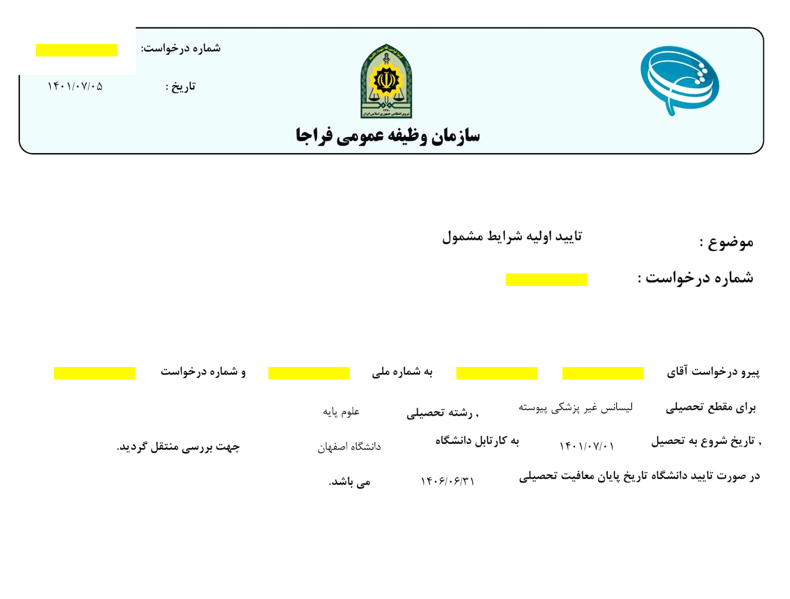

	توجه: این نسخه حاوی الفاظ رکیک است. از نشان دادن محتویات این صفحه به مسئولین +۴۰ ساله و مادرجنده خودداری کنید. برای دسترسی به نسخه باادبانه می‌توایند به لینک #tobe مراجعه نمایید.

این راهنما توسط جمعی از افراد مستقل تحت مجوز [کریتیو کامنز انتساب ۴٫۰ بین‌المللی (CC BY 4.0)](https://creativecommons.org/licenses/by/4.0/deed.fa) منتشر شده است. مسئولیت استفاده از مطالب آن به طور کامل به عهده‌ی خواننده است و تیم ویکی‌فرار هیچ مسئولیتی در قبال صحت مطالب نخواهد داشت. در صورت مشاهده‌ی اشتباه می‌توانید از این فرم #tobe برای ارسال اصطلاحیه استفاده کنید و یا اگر خیلی کیرتان درست است در گیتهاب #tobe کانتریبیوت کنید.

## فهرست کصوشریجات
1. [آزادسازی مدرک (اگه دانشجوی روزانه نیستید این مرحله رو اسکیپ کنین)](#1-آزادسازی-مدرک-اگه-دانشجوی-روزانه-نیستید-این-مرحله-رو-اسکیپ-کنین)
2. [درخواست فارغ‌التحصیلی](#2-درخواست-فارغالتحصیلی)
    1. [برگه پایان معافیت](#21-برگه-پایان-معافیت)
    2. [درخواست نامه لغو تعهد](#درخواست-نامه-لغو-تعهد)
3. [درخواست دانشنامه و ریزنمرات](#3-درخواست-دانشنامه-و-ریزنمرات)
    1. [معافیت تحصیلی دانشجویان خارج](#31-معافیت-تحصیلی-دانشجویان-خارج)

## 1. آزادسازی مدرک (اگه دانشجوی روزانه نیستید این مرحله رو اسکیپ کنین)

> به جای پرداخت پول می‌تونین از مسیر اداره کاریابی #tobe هم جلو برین. در این باره نیاز به نویسنده داریم و اگر کسی مطلبی داره که دوست داره منتشر کنه، میتونه از لینکای بالا استفاده کنه.

خب در قدم اول باید پول دولت رو بدین. مسخره است نه؟ این پرروهای مادرجنده رو میبینین؟ لیترالی باید پول «آموزش رایگان» رو بدین. میگم مادرجنده چون توی سایت هم همچنان تایتل بخش مربوطه‌ش «لغو تعهد آموزش رایگان»ـه. د خب خارکصده اگه رایگانه دیگه پرداختش به چیه. چرا اینقدر اذیت میکنین؟ چرا اینقدر فوش دوست دارین؟

مبلغش هم توی اینترنت هست. یه سرچ ساده با عنوان «هزینه آزادسازی مدرک» یا یه همچین چیزی، براتون لیستی از وبسایت های کصوشری مثل گروه مشاور تحصیلی هیوا رو میاره که وسط سه میلیون خط خزعبل خالص، یه جدول هزینه‌ها گذاشتن. 

در حال حاضر (شهریور ۱۴۰۵) علوم پایه تقریبا ترمی ۶،۳۰۰،۰۰ و مهندسی تقریبا ۷،۰۰۰،۰۰۰ تومن در میاد.

من آخرای ترم ۷ درخواستم رو ثبت کردم و قبل از اینکه امتحانات ترم ۷ شروع بشه برام لینک پرداخت رو ارسال کردن. هزینه‌ش تقریبا ۵۱ میلیون شد (علوم کامپیوتر بودم) که نشون میداد ترم ۸ رو هم لحاظ کردن. پس لازم نیست حتما ترم ۸ رو تموم کرده باشین که درخواستتون شامل ترم ۸ بشه. 

1. برای ثبت درخواست وارد سایت سجاد به آدرس portal.saorg.org میشین و گزینه «ورود کاربر متقاضی» رو میزنین. 
2. از منوی «خدمات» (دقت کنین «خدمات» رو میگم، نه «میز خدمت») وارد زیرمنوی «اداره کل امور دانشجویان داخل» شده و بعد روی «لغو تعهد آموزش رایگان کلیک میکنین.
3. اینجا یه صفحه باز میشه، با قوانین موافقت کنین.
4. مقطع مورد نظرتون رو انتخاب کنین. یعنی قشنگ باید روش یه بار کلیک کنین که سلکت بشه. ریدم تو UI و UXـتون با هم (اگه چیزی نشون نمیده احتمالا باید برگردید صفحه قبل و از بالای صفحه روی «ویرایش پروفایل» کلیک کنین و بعدش اطلاعات مقطع فعلیتون رو ثبت کنین).
5. واسه پسرا یه باکس اضافه هست که باید مدرک نظام‌وظیفه‌شون رو آپلود کنن. اگه مشغول به تحصیل هستین، «نوع مدرک نظام وظیفه» رو روی «گواهی اشتغال به تحصیل بر اساس گواهی معافیت تحصیلی معتبر» قرار بدین و بعدش اون گواهی اشتغال به تحصیلی که دارین رو آپلود کنین. تاریخ صدور رو میتونین از بالا سمت چپ گواهی مشاهده کنین. نمونه این گواهی رو اینجا می‌بینین:

    

6. و بله. دانشگاه اصفهان بودم. جای بدی نبود ولی باعث نمیشه نگم کیرم تو دانشگاه اصفهان. مخصوصا مسئول لغو تعهدش خانم کص‌دست‌پور.

7. اطلاعات تحصیلی سرراسته. اگه موقع ثبت درخواست هنوز دانشجویین، «وضعیت تحصیلی» رو «شاغل به تحصیل» بزنین. اما اما اما... دقت کنین که این کار باعث میشه توی نامه‌ی لغو تعهدتون بنویسن که شاغل به تحصیل هستین (duh!) و این خودش باعث میشه وقتی میخواین دانشنامه (همون مدرک کیری) رو از دانشگاه بگیرین، مسئولش بگه این نامه لغو تعهد ایراد داره! خدایی می‌بینین چقدر کصشره این فرایند؟ خب پفیوزا من دارم پولو میدم، دیگه چی کار داری تو دانشگاهم، تو توالتم، درس میخونم، فارغم، حاملم. 
   بگذریم. حالا راه حل چیه؟ فعلا شما باید درخواست رو ثبت کنین و پول رو بدین. بعدش که فارغ شدین، دوباره میایین همینجا و یه درخواست عین همین ثبت میکنین با این تفاوت که دیگه «وضعیت تحصیلی» رو میذارین روی «فارغ التحصیل» و رسید پرداخت قبلی رو هم میذارین کنارش تا بهتون یه نامه جدید بدن که توش نوشته شما نه تنها هیچ کیری به این جنده‌خونه بدهکار نیستین بلکه دیگه دانشجو هم نیستین. 
8. در مورد سهمیه:‌ اگه منطقه ۱ هستید که هیچی. ولی اگه ۲ و ۳ و باشین، باید به ترتیب ۲ و ۳ برابر پول بیشتر بدین! من خودم سهمیه منطقه ۲ داشتم. از منو انتخابش کردم و بعد برای «آیا درخواست بررسی تغییر به سهمیه منطقه یک را دارید؟» گزینه «بله» رو انتخاب و همون نرخ معمولی رو پرداخت کردم.
9. تصویه رفاهی رو هم بزنین بله.
10. اینجا یه آیکون آپلود هست که عنوان نداشت! توش ریزنمراتتون رو آپلود کنین.
11. نیم‌سال‌های تحصیلی: اینجا هر نیم سال رو سلکت کنین، بعدش از منوی «وضعیت» وضعیتش رو مشخص و سپس روی «ویرایش» بزنین. برای تمام ترم‌هاتون باید وضعیت رو مشخص کنین.
12. بعدش تیک گزینه پرداخت رو میزنین.
13. بعدش ثبت میکنین و ۱۰۰ هزار تومن ازتون پول میگیره که تایید کنه شما میتونین n میلیون تومن پول بدین :)

از اینجا به بعد درخواست میره سمت مسئول لغو تعهد دانشگاهتون. حتما زنگ بزنین دانشگاه و بگین اگه نقصی یا مشکلی هست همون موقع بهتون بگن که برطرف کنین. اگه دانشگاه اوکی رو بده و تایید کنه، درخواست میره سازمان امور دانشجویان دست خانم فاطمی. یه چند روزی طول میکشه و بعد براتون صفحه پرداخت باز میشه. دسترسی به صفحه پرداخت هم این‌شکلیه که توی صفحه‌ی اصلی پورتال سجاد، ستون «شماره پیگیری» آبی رنگ میشه و وقتی روش کلیک کنین میره توی یه صفحه‌ای که اطلاعات درخواستتون رو نوشته. بعدش کد امنیتی رو میزنین و پرداخت رو انجام میدین. چند روزی زمان میبره تا تایید کنن. 

## 2. درخواست فارغ‌التحصیلی
بعد از اینکه اخرین نمره‌تون هم ثبت نهایی شد، میتونین با مراجعه به آموزش دانشکده‌تون درخواست فارغ‌التحصیلی ثبت کنین. برای کسایی که گلستان دارن، یه گزارشی باز میشه که بدهی‌هاشون به دانشگاه رو پرداخت کنن. تلفن داخلی هر ارگانی که بهش بدهی دارن رو جلوش می‌بینین و سعی کنین اونقدر زنگ بزنین که زنشون گاییده بشه. برای من ۱۱ تا دفتر توی دانشگاه بود (من‌جمله صندوق قرض‌الحسنه امام صادق که هیچ ایده‌ای نداشتم توی دانشگاه وجود داره، چه برسه به اینکه بهش بدهی داشته باشم، که البته نداشتم) و در مجموع ۴۵ بار تماس گرفتم تا همه تاییدات توی ۱ ساعت انجام شد. این فرایند مثل بقیه بستگی به میزان گشادی اون دفترها داره.
بدهی‌ها رو که دادین، از پیشخوان گلستان درخواست فراغت ثبت می‌کنین. بعدش دونه دونه افرادی که باید تایید کنن رو پیدا کرده و با نشون دادن عکس زن و بچشون مجبورشون میکنین سریع تاییدات لازمه رو انجام بدن. 

### 2.1 برگه پایان معافیت
اینجا تقریبا بدون مشکل پیش میره و کارتون توی یه روز راه میفته. وقتی فارغ‌التحصیل شدین، یه برگه‌ی «پایان معافیت تحصیلی» از مسئول نظام وظیفه دانشگاه دریافت میکنین که باید پیش خودتون نگه دارین

### درخواست نامه لغو تعهد
یادتونه گفتم اگه هنوز دانشجو باشین و لغو تعهد کنین باید بعد از فراغت دوباره درخواست نامه لغو تعهد بدین؟ خب الان وقتشه. دوباره همون مراحل گام ۱ رو برین جلو ولی آخر درخواست تیک گزینه «قبلا پول رو ریختم تو حلقومتون» رو بزنین. بعدش شماره درخواستی که قبلا توی سجاد داده بودین رو بزنین (توی لیست درخواست‌ها، ستون شماره درخواست میتونین پیداش کنین). یه سری اطلاعات بانکی هم میخواد که میزنین و بعدش رسید پرداخت رو از همراه بانکتون میگیرین و آپلود میکنین. 

نکته بانک رفاه کارگران: دقت کنین که مثلا بانک رفاه کارگران، هم رسید میده هم جزئیات. سامانه سجاد یه «نام شعبه» میخواد که توی «جزئیات» اون پرداخت مشخصه. خود رسید رو هم باید آپلود کنین ولی نیازی به آپلود جزئیات نیست. در ضمن بانک رفاه کد شعبه میده، نه نام شعبه. همون کد رو بزنین اوکیه.   
## 3. درخواست دانشنامه و ریزنمرات
اینجا اگه پسر باشین موجودات عجیبی مثل اختاپوس هفت‌سر از زیر زمین پیدا میشن و یه‌جوری جلوتون سنگ میندازن که انگار پایین بودن نرخ قحبگی والده‌شون تقصیر شماست. اعتنا نکنین و مثل کرگدن برین جلو.

اگه دختر، آجندر، بای‌جندر، جندرفلوئیدی که در حال حاضر پسر نیست، جندرکوییر، دمی‌جندری که دمی‌بوی نیست یا نوترویس هستید، پاراگراف بعدی رو اسکیپ کنین:
آیا فکر می‌کنید وزارت علوم به آن +۵۰ میلیونی که دادید راضی میشود؟ وزارت به ریش شما خندیده است. باید وضعیت نظام‌وظیفه‌تان را هم مشخص کنید. اینجا سه راه دارین:
1. برگه اشتغال به تحصیل ارشد: میرید ارشد ثبت نام میکنین و با نامه اشتغال به تحصیل دانشگاه ارشدتون، مدرک رو از دانشگاه لیسانستون آزاد میکنین. برای این بخش نیاز به نویسنده‌های بیکار و با تجربه داریم #tobe.
2. برگ سبز اعزام سربازی: میرید پلیس+۱۰ و درخواست اعزام میدید. دقت کنین که در شرایط جنگی ممکنه تاریخ اعزامتون رو خیلی زودتر از چیزی که همیشه میزنن بزنن و براتون مشکل‌سازه بشه. مثلا اگه تاریخ اعزامتون مهر ماه باشه و شما کنکور ارشد داده باشید و نتایج کنکور آبان‌ماه بیاد و شما توی این یه ماه خودتون رو معرفی نکنین، یک ماه غیبت میخورین و ثبت‌نام دانشگاهتون با مشکل روبه‌رو میشه (اتفاقی که ۱۴۰۵ افتاد. هرچند میتونین با مدارک شرکت در کنکور، تاریخ اعزام رو تمدید کنین)
3. معافیت تحصیلی دانشجویان خارج: اگه از یه دانشگاه خارجی پذیرش دارین، میتونین یه معافیت تحصیلی خارجی بگیرین
   
   
### 3.1 معافیت تحصیلی دانشجویان خارج
1. اول وارد سایت سجاد به آدرس portal.saorg.org میشین. بعدش «خدمات» و «اداره کل بورس و اعزام دانشجویان» و «صدور معافیت تحصیلی»
2. با قوانین موافقت کنین.
3. روی مقطع تحصیلیتون کلیک کنین. مثلا کارشناسی پیوسته دانشگاه اصفهان
4. من تیک «دارای مدرک دیپلم» رو نزدم چون بعدش مجبور میشدم عکس مدرک دیپلم خارجی رو اپلود کنم که اصلا همچین چیزی نداشتم
5. شماره معافیت مقطع فارغ شده رو هم نداشتم.
6. اطلاعات مربوط به مقطعی که پذیرش گرفتید رو توی سربرگ «مشخصات مقطع تحصیلی جاری» وارد کنین.
7. اگه منوی «نام موسسه محل تحصیل» براتون خالی بود، روی دکمه‌ی سبز رنگ «ثبت درخواست اعتبارسنجی دانشگاه‌های خارجی» رو بزنین و دانشگاهتون رو ثبت کنین. وقتی موافقت بشه منو هم براتون باز میشه.
8. توی پیوست‌ها، تصویر پذیرش دانشگاه خارجیتون، مدرکی که توی ۲.۱ گفتم و پاسپورت رو اپلود کنین. اگر میخواین برین ایتالیا یونیورسیتالی رو اپلود کنین. اگه یونیورسیتالی ندارین، تقویم آموزشی دانشگاه خارجی رو اپلود کنین.
9. بعدشم مدرک زبان و ثبت و تمام.

حالا باید برید توی سخا هم درخواست ثبت کنین
1. وارد https://sakha.epolice.ir/portal بشین.
2. از منوی «وظیفه عمومی»، «درخواست معافیت تحصیلی خارجی» رو بزنین.
3. توی اون سرچ باکسِ «نوع درخواست»،‌ «معافيت تحصيلي دانشجويي خارج از کشور - وزارت علوم» رو انتخاب کنین (اگر وزارت بهداشت بودین، وزارت بهداشت رو انتخاب کنین ولی این آموزش بر اساس وزارت علومه)
4. بعدش ثبت درخواست و پر کردن فیلدها و مدارک. دقت کنین که همون مدارکی که توی سجاد آپلود کردین رو اینجا هم باید آپلود کنین. 
5. درخواست رو که ثبت کردین برگردین به صفحه اصلی. یعنی همون «درخواست معافیت تحصیلی خارجی». توی فهرست درخواست‌ها، ستون «ردگیری وضعیت درخواست» روی ذره‌بین بزنین. 
6. اینجا باید صبر کنین تا stateـش به «تایید نهایی وزارت علوم» تغییر کنه. یعنی اول بعد از چند ساعت یا روز میره روی «تایید اولیه وزارت علوم»، بعدش میره روی «تایید ثانویه وزارت علوم». 
7. وقتی تایید نهایی خورد، میرین نظام وظیفه شهرتون و یه نامه میگیرین که باهاش برین بانک و وثیقه بذارین (شهریور ۱۴۰۵ هستیم و وثیقه تحصیلی ۲۰۰ میلیونه. تا همین دو سه ماه پیش ۶۰ میلیون بود. کونیا)
8. #tobe
